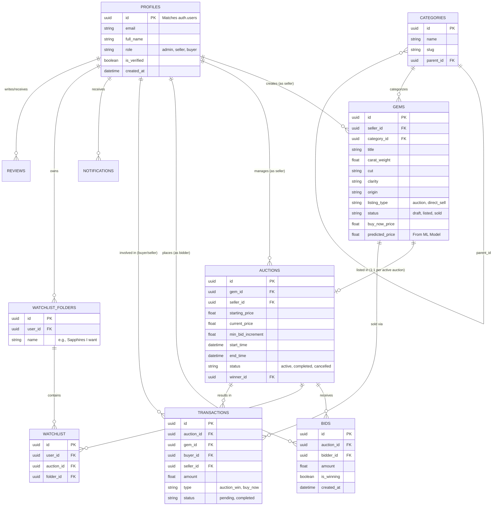

# Enhanced Entity-Relationship (EER) Diagram

The following diagram illustrates the database schema, including tables, relationships, and key columns for the Gem Auction Platform.

```mermaid
erDiagram
    PROFILES ||--o{ GEMS : "creates (as seller)"
    PROFILES ||--o{ AUCTIONS : "manages (as seller)"
    PROFILES ||--o{ BIDS : "places (as bidder)"
    PROFILES ||--o{ TRANSACTIONS : "involved in (buyer/seller)"
    PROFILES ||--o{ NOTIFICATIONS : "receives"
    PROFILES ||--o{ WATCHLIST_FOLDERS : "owns"
    PROFILES ||--o{ REVIEWS : "writes/receives"

    CATEGORIES ||--o{ CATEGORIES : "parent_id"
    CATEGORIES ||--o{ GEMS : "categorizes"

    GEMS ||--o| AUCTIONS : "listed in (1:1 per active auction)"
    GEMS ||--o{ TRANSACTIONS : "sold via"

    AUCTIONS ||--o{ BIDS : "receives"
    AUCTIONS ||--o{ WATCHLIST : "tracked in"
    AUCTIONS ||--o{ TRANSACTIONS : "results in"

    WATCHLIST_FOLDERS ||--o{ WATCHLIST : "contains"

    PROFILES {
        uuid id PK "Matches auth.users"
        string email
        string full_name
        string role "admin, seller, buyer"
        boolean is_verified
        datetime created_at
    }

    CATEGORIES {
        uuid id PK
        string name
        string slug
        uuid parent_id FK
    }

    GEMS {
        uuid id PK
        uuid seller_id FK
        uuid category_id FK
        string title
        float carat_weight
        string cut
        string clarity
        string origin
        string listing_type "auction, direct_sell"
        string status "draft, listed, sold"
        float buy_now_price
        float predicted_price "From ML Model"
    }

    AUCTIONS {
        uuid id PK
        uuid gem_id FK
        uuid seller_id FK
        float starting_price
        float current_price
        float min_bid_increment
        datetime start_time
        datetime end_time
        string status "active, completed, cancelled"
        uuid winner_id FK
    }

    BIDS {
        uuid id PK
        uuid auction_id FK
        uuid bidder_id FK
        float amount
        boolean is_winning
        datetime created_at
    }

    TRANSACTIONS {
        uuid id PK
        uuid auction_id FK
        uuid gem_id FK
        uuid buyer_id FK
        uuid seller_id FK
        float amount
        string type "auction_win, buy_now"
        string status "pending, completed"
    }

    WATCHLIST_FOLDERS {
        uuid id PK
        uuid user_id FK
        string name "e.g., Sapphires I want"
    }

    WATCHLIST {
        uuid id PK
        uuid user_id FK
        uuid auction_id FK
        uuid folder_id FK
    }
```
