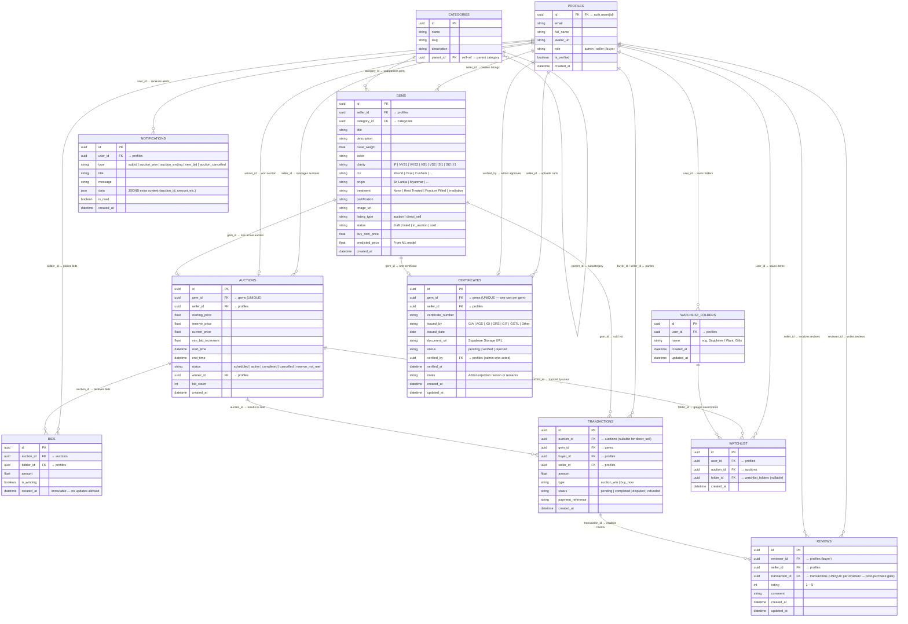

# Enhanced Entity-Relationship (EER) Diagram

The following diagram illustrates the full database schema for the GemBid platform, including all 11 tables, their columns, and FK relationships.

> **Tables:** profiles · categories · gems · auctions · bids · transactions · notifications · watchlist_folders · watchlist · certificates · reviews

---

## Key Constraints & Business Rules

| Rule | Enforced By |
|---|---|
| One active auction per gem | `UNIQUE(gem_id)` on `auctions` |
| One certificate per gem | `UNIQUE INDEX` on `certificates(gem_id)` |
| One review per buyer per transaction | `UNIQUE(reviewer_id, transaction_id)` on `reviews` |
| Buyer cannot review themselves | `CHECK (reviewer_id != seller_id)` on `reviews` |
| Seller cannot bid on own auction | Enforced inside `place_bid()` RPC |
| Bids are immutable (audit log) | `no_update_bids` rule on `bids` |
| Bid must exceed current price + increment | Validated inside `place_bid()` RPC |
| Certificate editable only while `pending` | RLS UPDATE policy on `certificates` |
| Review editable only within 7 days | RLS UPDATE policy on `reviews` |
| `treatment` column in gems feeds AI predictor | `CHECK` constraint on allowed values |