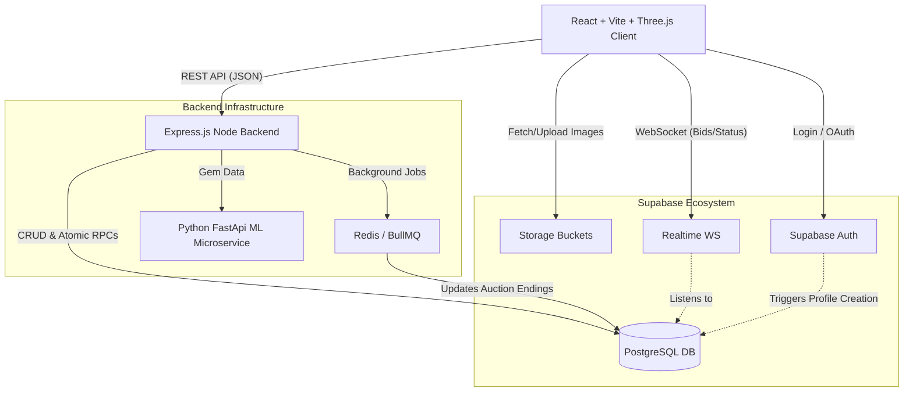
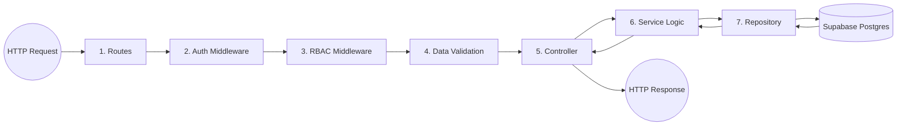

# System Architecture & Data Flow

This document details the high-level system components, integrations, and request lifecycle for the platform.

## High-Level System Diagram

## Request Lifecycle (Backend Data Flow)

To ensure clean code and strict separation of concerns, every API request in the Express application flows through the following pipeline:

### Layer Responsibilities:
1. **Routes:** Maps URL paths and HTTP verbs to specific controllers. Applies middlewares.
2. **Auth Middleware:** Verifies Supabase JWT tokens via `service_role` checks.
3. **RBAC Middleware:** Checks the `req.user.role` (e.g., `role_guard('admin', 'seller')`).
4. **Validation:** Runs Zod schema validations on `req.body` and `req.params`.
5. **Controller:** Extracts data from the request, passes it to the Service, and formats the response using standard `apiResponse` utility. Contains **no business logic**.
6. **Service:** Contains all business rules (e.g., checking if an auction is active before placing a bid).
7. **Repository:** Thin wrapper over the Supabase query builder (e.g., `.from('gems').select()`); Abstracts database complexity from the service layer.
