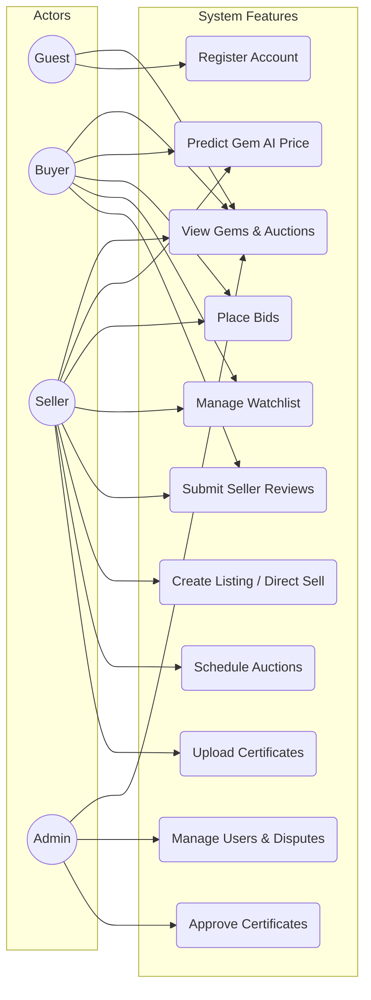

# User Roles & Use Case Diagrams

The platform serves three primary authenticated roles, alongside guest users.

## Role Capabilities

## Key Workflows

### 1. Gem Listing & AI Prediction Workflow
1. **Seller** initiates a new Listing.
2. Seller inputs Carat, Cut, Clarity, Origin.
3. Seller clicks **"AI Prediction"**.
4. System queries Python ML Microservice.
5. System displays Predicted $ Price + SHAP visualization.
6. Seller sets "Starting Price" based on AI logic.
7. Seller publishes Gem to active Auction.

### 2. Live Bidding Workflow
1. **Buyer** navigates to an Active Auction.
2. Realtime WebSocket connects.
3. Buyer submits Bid.
4. Express Backend routes request to **Postgres RPC Function**.
5. Postgres performs Atomic check (Bid > Current Price + Increment).
6. Bid is saved.
7. Postgres trigger updates Auction `current_price` and `bid_count`.
8. Supabase Realtime pushes new price to all connected clients instantly.
